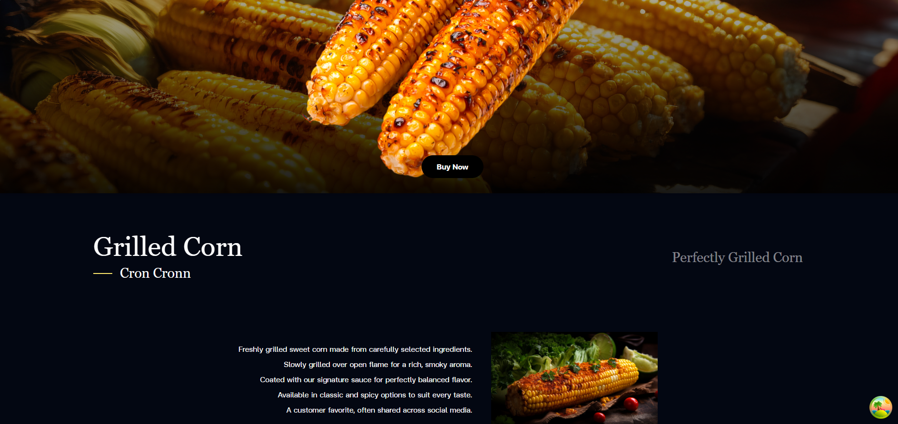
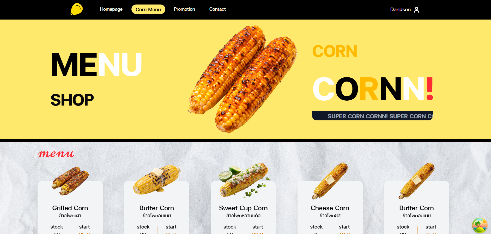
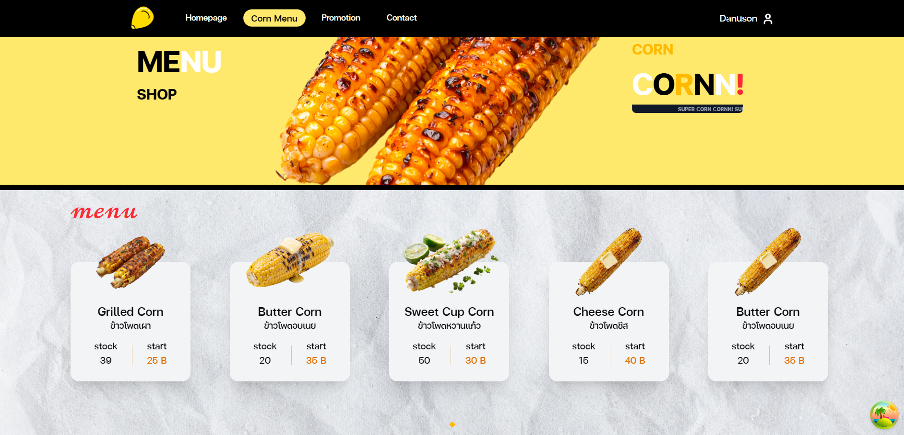
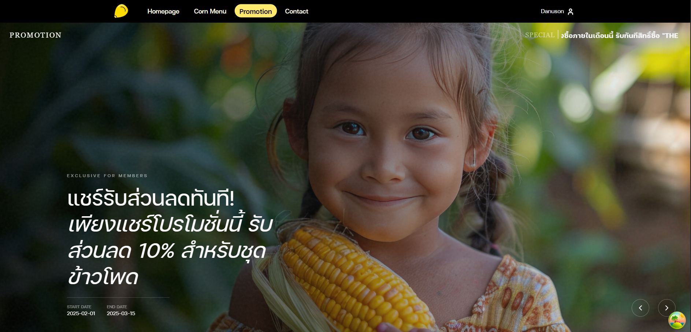
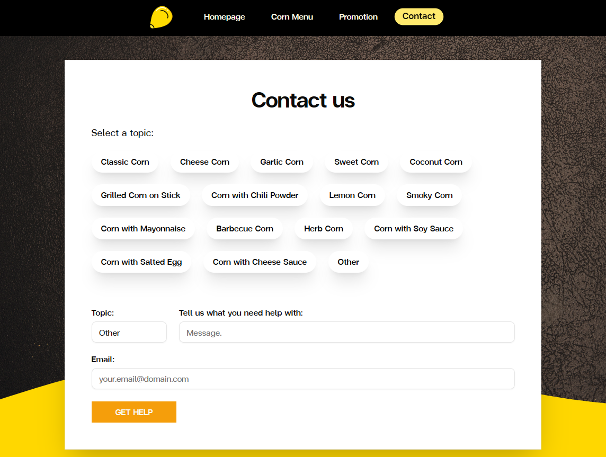
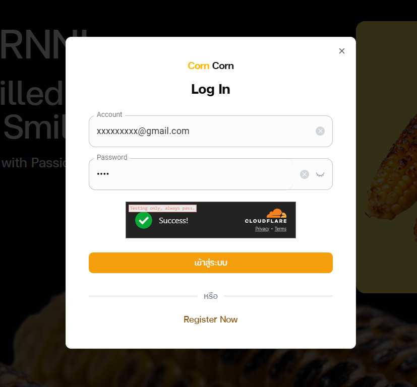
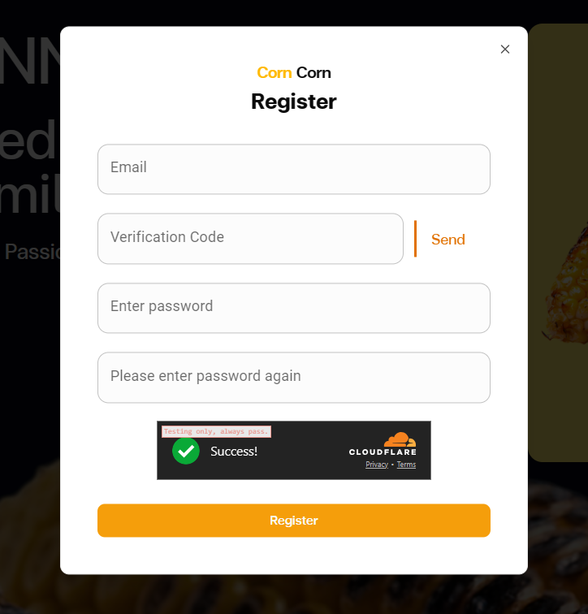

# Corn Corn Frontend

Frontend web application สำหรับร้าน **Corn Corn** พัฒนาโดยใช้ **React + TypeScript (.tsx)** เชื่อมต่อกับ Backend API ที่เขียนด้วย Go


# Tech Stack

* **React (TypeScript)**
* **CSS** (custom styling)
* **TanStack Router** – จัดการเส้นทาง (Routing)
* **TanStack Query** – ดึงข้อมูลจาก Backend API
* **REST API**


# Backend

Backend เขียนด้วย **Go (Fiber)** สำหรับจัดการ Authentication, OTP, Menu, Promotion และ Contact

GitHub Repository (Backend):
[https://github.com/Danuson17-8/corn-backend](https://github.com/Danuson17-8/corn-backend)


# Routing (TanStack Router)

ใช้ **TanStack Router** ในการกำหนดเส้นทางของแอป files in `src/routes`.
ช่วยให้ routing มี type-safety และจัดการโครงสร้างได้ชัดเจน


# Data Fetching (TanStack Query)

ใช้ **TanStack Query** สำหรับ

* ดึงข้อมูลเมนูจาก Backend
* จัดการ loading / error state
* Cache ข้อมูลอัตโนมัติ


# Styling

* ใช้ **CSS** ในการตกแต่ง UI


# Getting Started

```bash
# install dependencies
npm install

# run development server
npm run dev
```


# Preview

### Home Page
<p align="center">
  
  
</p>

### Menu Page
<p align="center">
  
  
</p>

### Promotion Page
<p align="center">
  
  
</p>

### Contact
<p align="center">
  
</p>

### Login / Register
<p align="center">
  
  
</p>

# License

This project is for educational and portfolio purposes.
